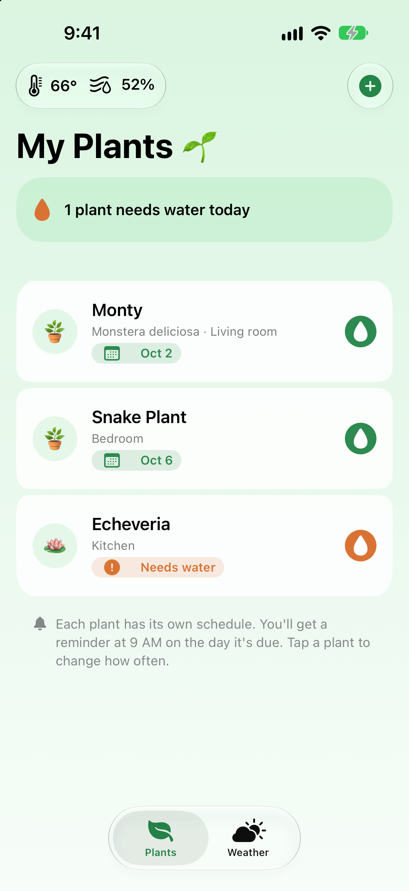
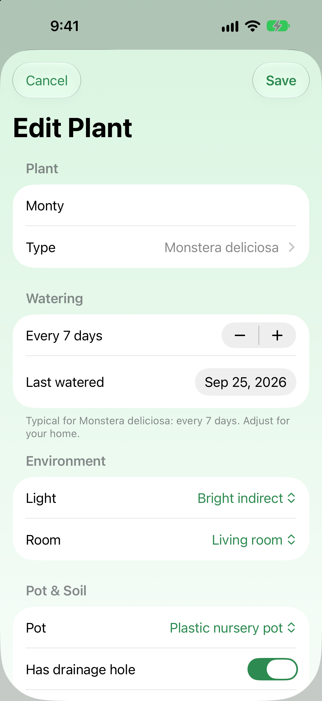
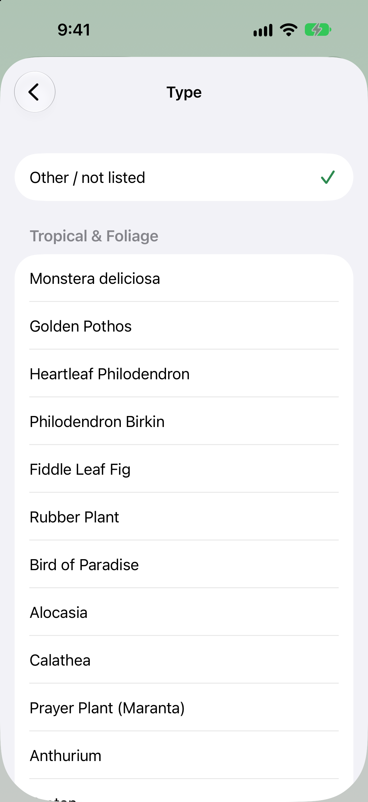
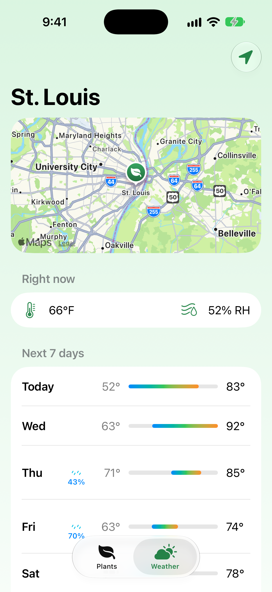

# Project Gaia 🌱

A simple iPhone app for tracking houseplants and when they need water. Built with SwiftUI and SwiftData.

## Screenshots

  
  
  
  

## Features

- Plant list with watering status. Plants that are due are highlighted, and one tap marks a plant as watered.
- Add Plant form with 63 common plants in 7 groups. Picking a plant pre-fills its typical watering schedule and light needs.
- Tap any plant to edit its details.
- Track light, room, pot type, drainage, soil, fertilizing schedule, and notes.
- Plants are saved on the device with SwiftData, so they persist between launches.
- Each plant shows an emoji matched to its species.
- Weather tab with a map, place search, and "use my location". The chosen place is remembered.
- Weather tips for outdoor plants: frost risk, rain coming, or hot days ahead.
- A watering reminder notification at 9 AM on the day each plant is due.
- Green garden theme with a custom app icon and light and dark mode.

## Project structure

| File | What it does |
|---|---|
| `MyApp.swift` | App entry point; sets up the SwiftData database |
| `Plant.swift` | Data model (the "plants table"), choice lists, and plant catalog |
| `ContentView.swift` | Main plant list screen |
| `AddPlantView.swift` | Form for adding and editing plants |
| `WeatherView.swift` | Weather tab: forecast, map, search, and location |
| `WateringTips.swift` | Rules that turn the forecast into tips for outdoor plants |
| `WateringAlerts.swift` | Schedules the watering reminder notifications |
| `Theme.swift` | Colors and background |

## What I learned

I'm moving into data engineering, and this project let me apply database ideas I use with SQL to app development:

- **The data model is a table.** `Plant` is a SwiftData `@Model`. Each property is a column, and each plant is a row.
- **Queries, inserts, updates and deletes map to SQL.** `@Query(sort: \Plant.dateAdded)` works like `SELECT * FROM plants ORDER BY dateAdded`. Adding, editing, watering and deleting a plant are INSERT, UPDATE and DELETE operations.
- **Store stable keys, not display text.** Choices like room and light are saved as short keys (`livingRoom`) with separate display labels (`"Living room"`), so wording can change without breaking saved data. It's the same reason you join on an ID instead of a name.
- **Lookup tables.** A built-in plant catalog, a lookup table, supplies care defaults, and plants are matched to it by species. This is similar to a join.
- **Dates are tricky.** Watering is due by calendar day, not by exact timestamp, so a plant is due all day rather than only after the time it was last watered.

## Running it

Open `PlantCare.xcodeproj` in Xcode (iOS 27 SDK), choose an iPhone simulator, and press Run.

## Ideas for next steps

- Fertilizing tracker
- Plant photos

## License

Copyright (c) 2026 Evan Gilb. All rights reserved. See [LICENSE](LICENSE). The code is public so it can be viewed, but it may not be copied, reused, or redistributed without permission.
